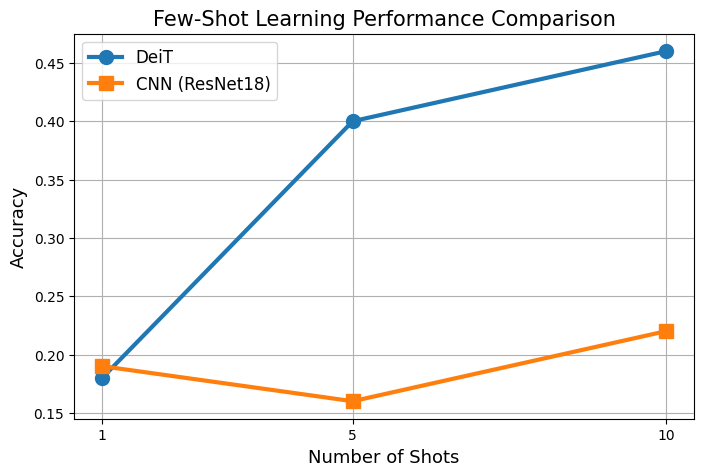

# FewShot-Okra-DeiT(small)-vs-CNN(ResNet18)
An efficiency and accuracy comparison between the DeiT vs CNN model on Few-Shot learning.

This project investigates **few-shot learning performance** for plant disease classification using:
- Vision Transformer (DeiT-small)
- Convolutional Neural Network (ResNet-18)

The goal is to analyze how well modern deep learning models perform when training data is extremely limited (1-shot, 5-shot, 10-shot scenarios).

# Problem Statement
In real-world agriculture, labeled data is often scarce. This work explores:

How do Vision Transformers compare to CNNs in few-shot plant disease classification tasks?

We evaluate model performance under extremely limited training samples per class.

# Models Used
## 1. Vision Transformer
- Pretrained on ImageNet
- Fine-tuned for few-shot learning

## 2. CNN Baseline
- Pretrained ResNet-18
- Fully connected layer modified for classification

# Dataset
https://data.mendeley.com/datasets/nh7zk4hv8z/1
- Plant disease dataset (okra leaves)
- Classes: 6 disease categories
- Each class contains training, validation, and test images
- Few-shot sampling applied:
  - 1-shot
  - 5-shot
  - 10-shot

# Experimental Setup
## Few-Shot Settings:
- 1 image per class
- 5 images per class
- 10 images per class

## Training Strategy:
- Transfer learning (pretrained models)
- Data augmentation:
  - rotation
  - flipping
  - color jitter
  - blur
- Cross-entropy loss
- AdamW optimizer

# Repeated Experiments (3 Runs per Setting)
To ensure fair and reliable evaluation, each few-shot setting was trained **three times with different random samples**.

This is important because few-shot learning is highly sensitive to:
- random selection of training samples
- initialization effects
- data augmentation randomness

# Experimental Protocol
Epochs: 15

For each model:
 1-shot → 3 independent runs
 5-shot → 3 independent runs
 10-shot → 3 independent runs

Results of all 3 few-shots (1,5,10) of Deit model and CNN model with 3 runs.

Deit=> 0.18, 0.446, 0.373 and CNN=> 0.18, 0.13, 0.26
Deit=> 0.23, 0.446, 0.426 and CNN=> 0.16, 0.18, 0.26
Deit=> 0.14, 0.3,   0.58  and CNN=> 0.23, 0.16, 0.13

Final results are reported as:
-> **Average accuracy across 3 runs**

# Results
| Few-Shot Setting | DeiT-small Accuracy | CNN-ResNet18 Accuracy |
|------------------|---------------------|-----------------------|
| 1-shot           | 0.18                | 0.19                  |
| 5-shot           | 0.40                | 0.16                  |
| 10-shot          | 0.46                | 0.22                  |

# Key Findings
- CNN and DeiT perform similarly at **extreme low-data (1-shot)**.
- Vision Transformer significantly outperforms CNN at **5-shot and 10-shot settings**.
- CNN shows slower improvement with increasing data.
- Transformer models demonstrate better feature transferability.
- Some variance observed in transformer performance due to few-shot sampling sensitivity.

# Graphs
## Few-Shot Accuracy Comparison
!(Few-Shot Accuracy Comparison Graph.png)

## Stability Graph
(Stability - Variance Graph.png)

## Bar Chart Comparison
(Bar Chart Comparison.png)

# Conclusion
This study shows that transformer-based models such as DeiT:
- are more effective in low-data regimes
- outperform CNN baselines in few-shot plant disease classification
- but exhibit sensitivity to data sampling and training variance
- 

# Future Work
- Improve few-shot stability using:
  - metric learning
  - prototypical networks
  - better fine-tuning schedules
- Extend dataset to more crop diseases
- Explore hybrid CNN-Transformer architectures

# Author
Syed Numan Raza
Research Project  
Focus: Computer Vision, Deep Learning, Few-Shot Learning, Agriculture AI

License This project is licensed under the MIT License - see the LICENSE file for details.
Special thanks to the PyTorch team for providing tools to build and train deep learning models.
